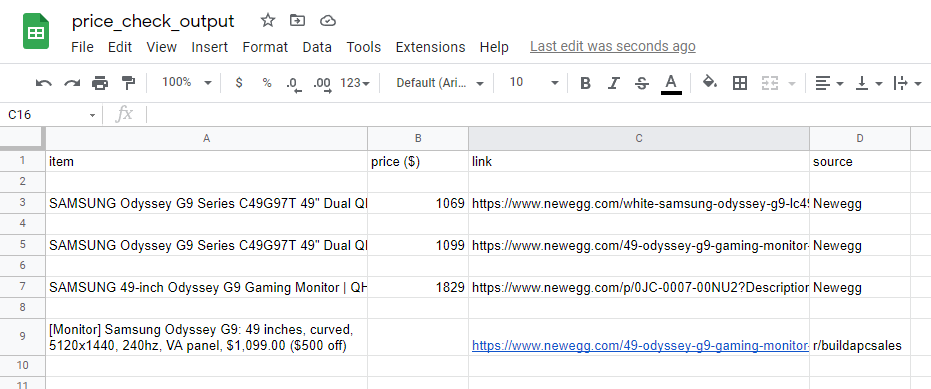
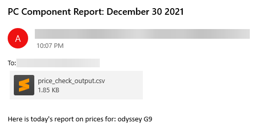

# price-check-notifier-v2  
Improving on a past project I did (price-check-notifier) which used Twilio API to send whatsapp notifications once an Amazon product fell below a set price. Unfortunately, my free Twilio trial ended. Fortunately, I made some big changes.  
## What does it do?  
Given a component (currently inputted by user but can be hardcoded in for automation purposes), this script searches Newegg and Reddit for the component. On Reddit, the top daily posts are searched (but this can be changed easily, I just did it assuming one might automate the script to run daily). The search results containing name of product, price, link/url, and source (newegg or reddit) are then 1) written to a CSV and sent to an email (can be easily changed to an SMS) and 2) inserted into a SQL table for future queries.  
## What did I learn?  
I used new libraries such as email and smtplib (to send emails), praw (to communicate with reddit), re (regular expressions), and sqlite3 (SQL).  
I also used better Python project practices such as adding a main() function.  
I worked with more complex data structures (e.g. storing search results in list of dicts).  
And overall, this project was a little more custom than the last so I couldn't rely on full tutorials as much and had to turn to docs and other sources of help more.  
## Script in action  
Example search results:  
  

Example email sent after search:  
  
## Next steps/improvements  
Time series forecasting using price data stored in the SQL table.  
Scrape other sites like Amazon and eBay  
Web app and/or UI
